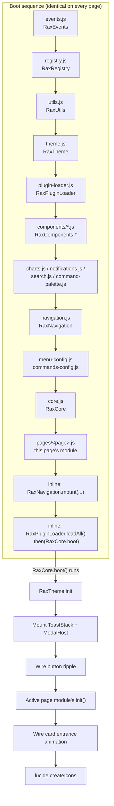
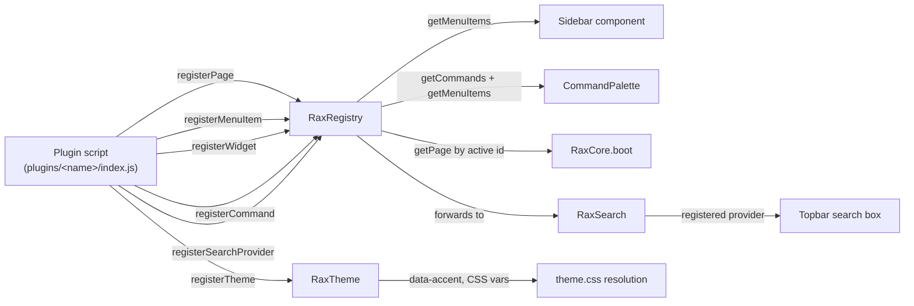
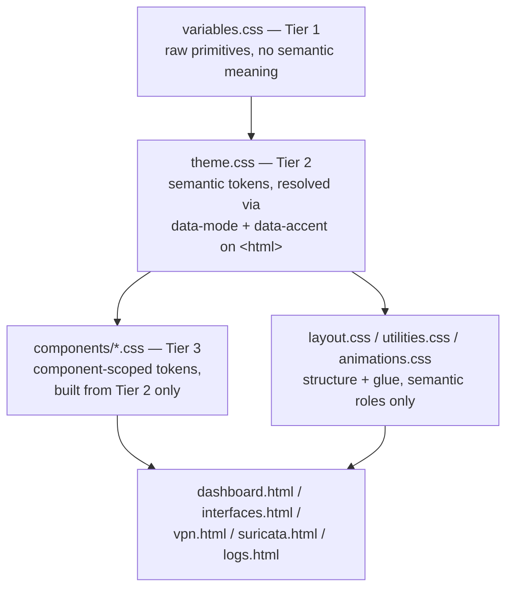
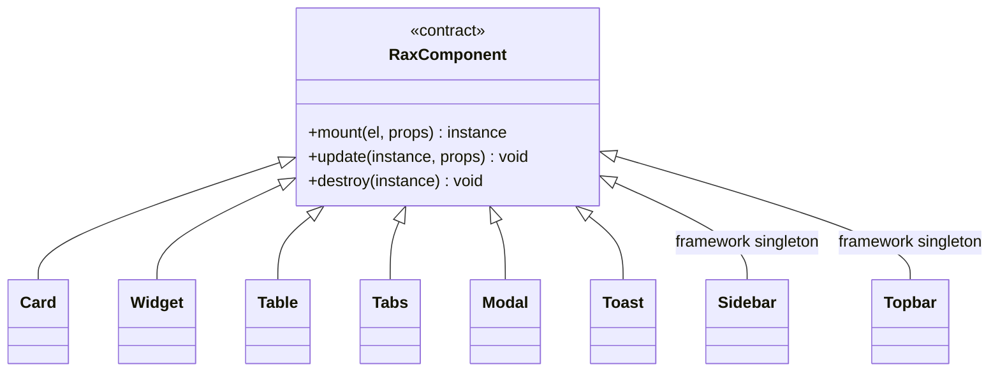

# RAX Theme — Architecture Diagram

Rendered automatically by GitHub in any Markdown file. Source is plain
[Mermaid](https://mermaid.js.org/) — no build step, no image file to keep in
sync.

## Module dependency + boot order

## Extension API surface

## CSS token layering

## Component contract

